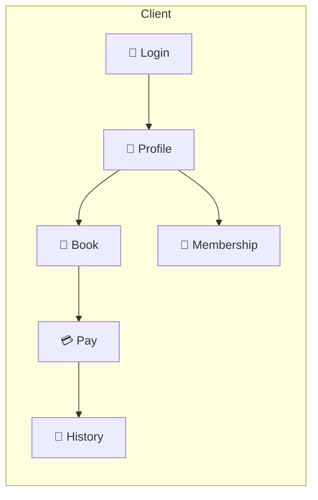

# medical-aesthetics

<p align="center">
  <strong>🏥 Online Booking System for Medical Aesthetic Clinics</strong>
</p>

<p align="center">
  Powered by <strong>📋 Spec kit</strong> and <strong>🤖 Claude</strong> for specification and development workflow
</p>

---

## 📖 Overview

**medical-aesthetics** is an online booking and membership system for medical aesthetic clinics. It covers login and auth, user profile, appointment booking (procedure, time, doctor), online payment, and membership tiers with benefits and balance. Specifications are written with **📋 Spec kit** and design and implementation are assisted by **🤖 Claude**.

| Icon | Description |
|------|-------------|
| 📋 **Spec kit** | Specification and requirements tool for writing and maintaining feature specs, acceptance scenarios, and task breakdowns |
| 🤖 **Claude** | AI assistant for clarification, design, and implementation collaboration |

---

## ✨ Features



| Module | Description |
|--------|-------------|
| 🔐 **Login & Register** | Register or log in with phone/email; session and logout |
| 👤 **Profile** | View and edit current user info (name, contact, avatar, etc.) |
| 📅 **Online Booking** | Choose procedure, time, and doctor; complete booking flow |
| 💳 **Online Payment** | Pay for appointments and services; payment history |
| 📜 **History** | Appointment and payment history |
| 🎁 **Membership** | Tiers, benefits, and user balance |

---

## 🛠 Tech Stack

| Category | Stack |
|----------|-------|
| 📦 Build | [Rsbuild](https://rsbuild.dev/) |
| ⚛️ Frontend | React 18+, React Router, TanStack Query |
| 🎨 Styles | Tailwind CSS |
| 📘 Language | TypeScript 5.x (strict) |
| 🔌 API | gRPC-Web (online booking) |
| ✅ Quality | Vitest, ESLint, Prettier |

---

## 📁 Project Structure

```text
medical-aesthetics/
├── src/                    # Frontend source
├── tests/                  # Tests
├── specs/                  # 📋 Spec kit feature specs
│   └── 001-online-appointment-booking/
│       └── spec.md         # Online booking spec
├── .specify/               # Spec kit config and templates
└── .cursor/                # Cursor rules and config
```

---

## 🚀 Quick Start

### Requirements

- **Node.js** >= 18

### Install and run

```bash
# Install dependencies
npm install

# Development
npm run dev

# Build
npm run build

# Preview build
npm run preview
```

### Quality

```bash
# Test and lint
npm test && npm run lint

# Format
npm run format
```

---

## 📋 Specs (Spec kit)

Current feature branch and spec:

| Branch / Spec | Description |
|---------------|-------------|
| `001-online-appointment-booking` | Full online booking flow: login, profile, booking, payment, membership, history |

For detailed scenarios, acceptance criteria, and constraints, see:  
**[specs/001-online-appointment-booking/spec.md](./specs/001-online-appointment-booking/spec.md)**

---

## 📄 License & Contributing

- This repo is private; see repo policy for license terms.
- Development guidelines: [.cursor/rules](./.cursor/rules).

---

<p align="center">
  <sub>📋 Spec kit · 🤖 Claude · 🏥 medical-aesthetics</sub>
</p>
