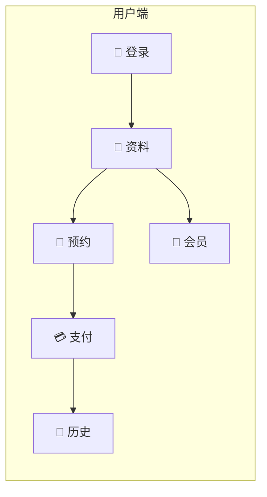

# medical-aesthetics

<p align="center">
  <strong>🏥 医美机构在线预约系统</strong>
</p>

<p align="center">
  基于 <strong>📋 Spec kit</strong> 与 <strong>🤖 Claude</strong> 驱动的需求规范与开发工作流
</p>

---

## 📖 项目简介

**medical-aesthetics** 是一套面向医美机构的在线预约与会员管理系统，涵盖登录鉴权、个人资料、预约选时选医生、在线支付以及会员等级与余额等完整能力。需求与实现由 **📋 Spec kit** 规范编写、由 **🤖 Claude** 辅助设计与开发。

| 图标 | 说明 |
|------|------|
| 📋 **Spec kit** | 规范与需求管理工具，用于编写和维护功能规格（Feature Spec）、验收场景与任务拆解 |
| 🤖 **Claude** | AI 助手，用于在规范澄清、方案设计与代码实现阶段提供协作 |

---

## ✨ 功能概览



| 模块 | 说明 |
|------|------|
| 🔐 **登录与注册** | 手机/邮箱注册与登录，会话保持与登出 |
| 👤 **个人资料** | 查看与编辑当前用户基本信息（姓名、联系方式、头像等） |
| 📅 **在线预约** | 选择项目、时间与医生，完成预约流程 |
| 💳 **在线支付** | 预约与消费的在线支付与记录 |
| 📜 **历史记录** | 预约记录与支付记录查询 |
| 🎁 **会员体系** | 会员等级、会员权益与用户余额管理 |

---

## 🛠 技术栈

| 类别 | 技术 |
|------|------|
| 📦 构建 | [Rsbuild](https://rsbuild.dev/) |
| ⚛️ 前端 | React 18+、React Router、TanStack Query |
| 🎨 样式 | Tailwind CSS |
| 📘 语言 | TypeScript 5.x（strict） |
| 🔌 接口 | gRPC-Web（在线预约相关） |
| ✅ 质量 | Vitest、ESLint、Prettier |

---

## 📁 项目结构

```text
medical-aesthetics/
├── src/                    # 前端源码
├── tests/                  # 测试
├── specs/                  # 📋 Spec kit 产出的功能规格
│   └── 001-online-appointment-booking/
│       └── spec.md         # 在线预约功能规格
├── .specify/               # Spec kit 配置与模板
└── .cursor/                # Cursor 规则与配置
```

---

## 🚀 快速开始

### 环境要求

- **Node.js** >= 18

### 安装与运行

```bash
# 安装依赖
npm install

# 开发模式
npm run dev

# 构建
npm run build

# 预览构建结果
npm run preview
```

### 质量检查

```bash
# 测试 + 代码检查
npm test && npm run lint

# 格式化
npm run format
```

---

## 📋 功能规格（Spec kit）

当前在做的功能分支与规格文档：

| 分支 / 规格 | 说明 |
|-------------|------|
| `001-online-appointment-booking` | 在线预约全流程：登录、资料、预约、支付、会员与历史记录 |

详细场景、验收条件与约束见：  
**[specs/001-online-appointment-booking/spec.md](./specs/001-online-appointment-booking/spec.md)**

---

## 📄 许可与贡献

- 项目为私有仓库，具体许可以仓库约定为准。
- 开发规范与约定见 [.cursor/rules](./.cursor/rules)。

---

<p align="center">
  <sub>📋 Spec kit · 🤖 Claude · 🏥 medical-aesthetics</sub>
</p>
